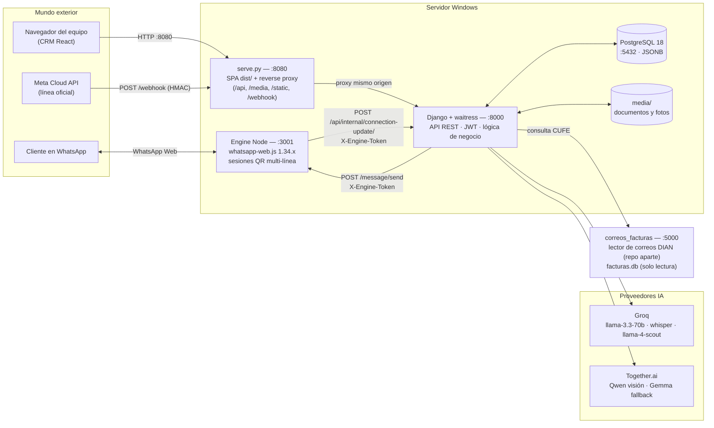
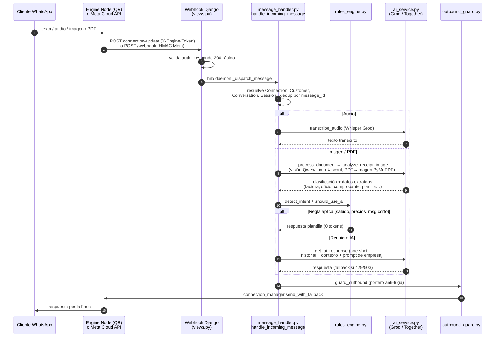
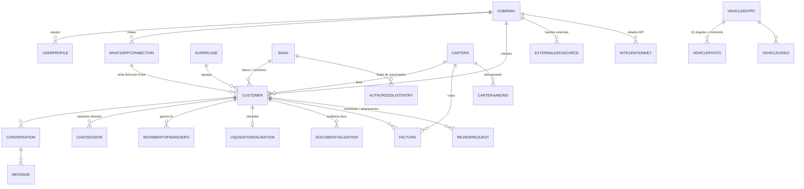
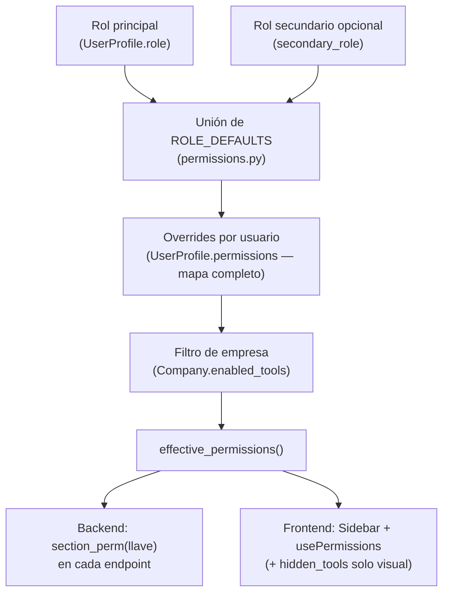
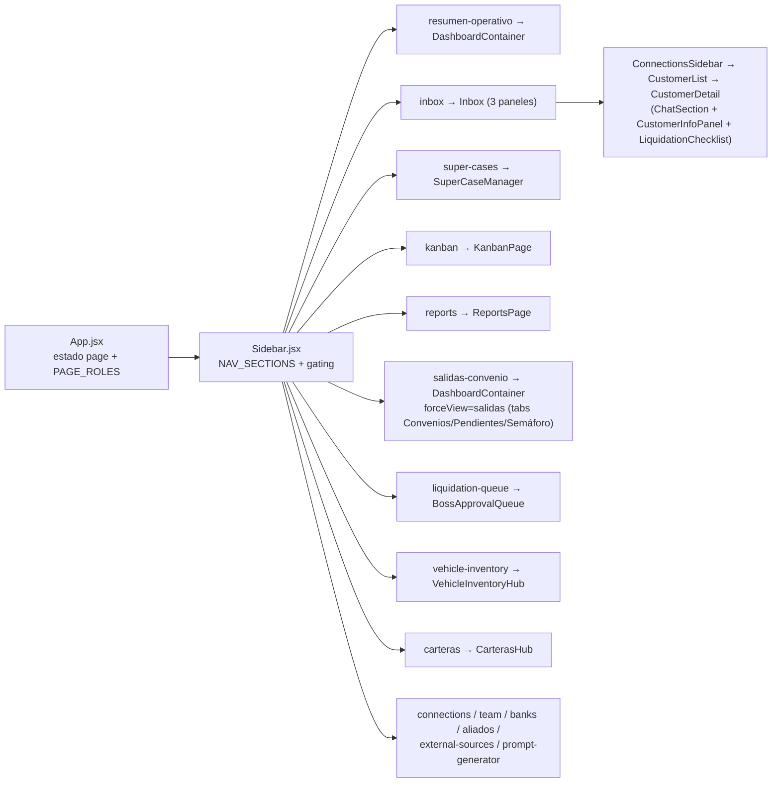
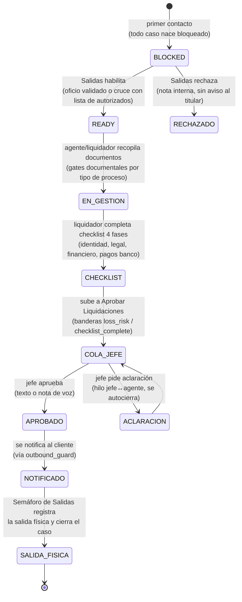
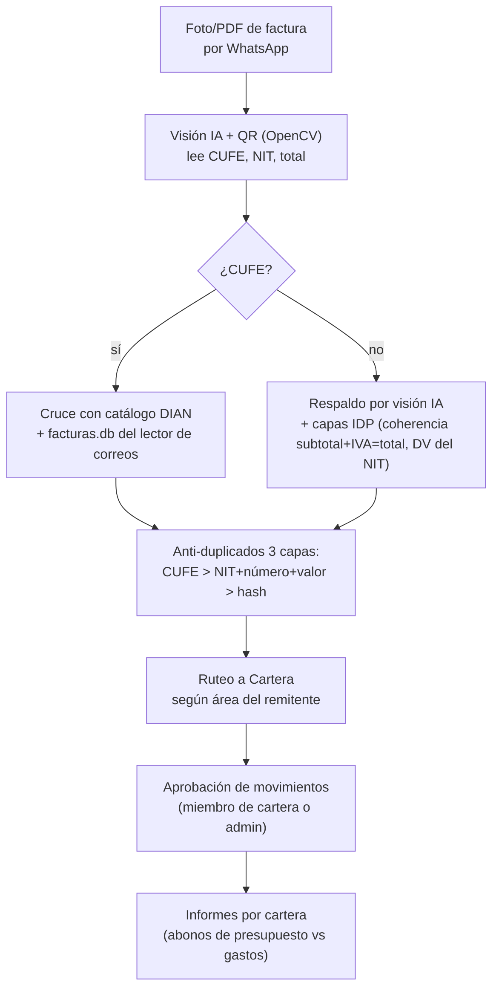
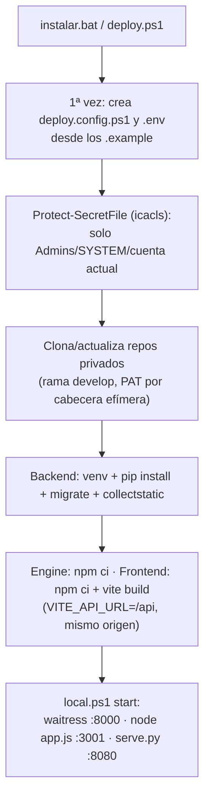

# Documentación del sistema — BootWhatsapp CRM

> **Fecha**: 2026-07-28 · **Alcance**: arquitectura completa (backend, frontend, engine WhatsApp, despliegue, flujos de negocio) con diagramas.
>
> Documentos complementarios:
> - [SYSTEM_SCOPE.md](SYSTEM_SCOPE.md) — alcance funcional y barreras técnicas.
> - [Backend/API_DOCS.md](Backend/API_DOCS.md) — referencia detallada de la API REST.
> - [ESQUEMA_BD.md](ESQUEMA_BD.md) — diagrama ER completo de la base de datos (mermaid) + [ESQUEMA_BD.svg](ESQUEMA_BD.svg).
> - [GUIA_DESPLIEGUE.md](GUIA_DESPLIEGUE.md) — despliegue paso a paso.

---

## 1. ¿Qué es BootWhatsapp?

Plataforma CRM multi-empresa (multi-tenant) centrada en WhatsApp para la operación de un parqueadero/almacenadora de vehículos. Combina:

- **Bot híbrido de WhatsApp**: responde por plantillas (0 tokens) o por IA (Groq/Together) según el mensaje; transcribe audios, lee documentos (oficios, facturas, comprobantes, planillas de inventario) con visión artificial.
- **CRM web (React)**: bandeja de chats multi-línea, Resumen Operativo "zero-chat", Súper Casos, Kanban, Reportes con gráficos y exportación.
- **Flujos de negocio**: gate de Salidas, convenios bancarios, liquidaciones con checklist y aprobación del jefe, facturas electrónicas DIAN, carteras de gastos, inventario vehicular fotográfico.
- **Integraciones**: gateway API para aliados, fuentes externas de datos, lector de correos DIAN (proyecto aparte).

---

## 2. Arquitectura general

Tres procesos nativos en Windows (sin Docker) + PostgreSQL externo. **Solo se expone el puerto 8080**; todo lo demás es loopback.

### Puertos y procesos

| Proceso | Tecnología | Puerto | Expuesto |
|---|---|---|---|
| Frontend + proxy | `native/serve.py` (Python stdlib) | **8080** | ✅ único |
| Backend API | Django + waitress (16 threads) | 8000 | ❌ loopback |
| Engine WhatsApp | Node + whatsapp-web.js | 3001 | ❌ loopback |
| Base de datos | PostgreSQL 18 | 5432 | ❌ local |
| Lector de correos | Proyecto `C:\correos_facturas` | 5000 | ❌ loopback |

`serve.py` sirve el SPA y proxea `/api/`, `/media/`, `/static/`, `/webhook` y `/healthz_backend` al backend → **todo en el mismo origen**, sin CORS, y los documentos de `/media` cargan directo.

---

## 3. Las dos vías de WhatsApp

El sistema soporta dos tipos de línea (`WhatsAppConnection.connection_type`):

1. **QR (engine propio)** — `whatsapp-web.js` con Puppeteer/Chrome headless. Cada línea (`connection_id`) tiene su propio Chrome y perfil `.wwebjs_auth/session-conn_<id>/`. El engine reenvía todo a Django por `POST /api/internal/connection-update/` (mensajes con media en base64, estados `qr_ready`/`connected`/`heartbeat`/`disconnected`), autenticado con header `X-Engine-Token` (comparación en tiempo constante) + whitelist de IPs.
2. **Meta Cloud API (oficial)** — Meta llama directo a `POST /webhook` (público vía serve.py). Se valida la firma `X-Hub-Signature-256` (HMAC-SHA256 con `WHATSAPP_APP_SECRET`, fail-closed) y el `hub.verify_token` en la verificación GET.

Robustez del engine ([engine/app.js](Frontend/bootwhatsapp_frontend/engine/app.js), `whatsappClient.js`, `django.js`):
- Latido cada 60 s con prueba real del navegador; reconexión con backoff (5 s → 120 s, máx. 10 intentos).
- `process.exit(1)` si el puerto ya está ocupado (evita engines duplicados que se matan el Chrome entre sí).
- Al arrancar, `restoreSessions()` pregunta a Django (`GET /api/internal/qr-connections/`) qué líneas restaurar sin re-escanear QR.
- Soporte de cuentas migradas a LID, backfill de históricos y catch-up de grupos cada 10 min.

---

## 4. Flujo de un mensaje entrante

Puntos clave:

- **Economía de tokens**: `RulesEngine.should_use_ai()` filtra primero; la mayoría de mensajes (saludos, "ok") se responden por plantilla sin tocar la IA. La IA es **one-shot** (sin estado en el modelo; la memoria vive en BD).
- **Gates deterministas antes de la IA** en `_resolve_bot_response()`: gate de Salidas, validaciones pendientes, intake de oficio en primer contacto.
- **Portero de salida** (`outbound_guard.py`): TODA respuesta al cliente pasa por él; datos confidenciales de liquidación se bloquean (422), y el eco de documentos solo puede mencionar campos de una whitelist.
- **Resiliencia IA**: `_llm_resiliente` corre Groq y Together y gana el primero; circuit breaker de 60 s ante 429/503; **nunca reintenta** — degrada a `FALLBACK_MESSAGE`.

### Modelos de IA en uso

| Uso | Primario | Respaldo |
|---|---|---|
| Texto / conversación | Groq `llama-3.3-70b-versatile` | Together Gemma |
| Audio → texto | Groq `whisper-large-v3-turbo` | — |
| Visión (documentos) | Together `Qwen3.5-9B` (2 etapas: transcribir → razonar) | Groq `llama-4-scout` |
| CUFE de facturas (2ª opinión) | Together Gemma | — |
| Planilla de inventario (campos críticos) | Together Gemma razonador | — |

La visión usa una **caché en disco por hash de contenido** (TTL 30 días): cada documento se "ve" una sola vez, aunque se reprocese.

---

## 5. Backend Django (`Backend/bootwhatsapp`)

Dos apps: **`core`** (configuración, `settings.py`, `urls.py`) y **`chat`** (toda la lógica: modelos, servicios, vistas REST, permisos, management commands).

### 5.1 Dominios y modelos principales

> El ER completo con todas las columnas está en [ESQUEMA_BD.md](ESQUEMA_BD.md).

| Dominio | Modelos | Notas |
|---|---|---|
| Tenant y usuarios | `Company`, `UserProfile` | `enabled_tools` (plataforma adaptativa), `role` + `secondary_role`, `hidden_tools`, `review_specialties` |
| Mensajería | `WhatsAppConnection`, `Customer`, `Conversation`, `Message`, `ChatSession`, `CustomerContext`, `Tag` | Unicidad `(phone, company, connection)`; `access_token` cifrado Fernet; `Message.internal` para notas |
| CRM | `SuperCase`, `ReviewRequest`/`ReviewMessage`, `KanbanBoard`, `TimelineEvent`, `Bank` | Súper Casos auto-vinculan por `target_phone` |
| Finanzas | `MovimientoFinanciero`, `Cartera`, `CarteraAbono` | Movimientos extraídos por IA de comprobantes |
| Liquidación | `LiquidationValidation`, `DocumentValidation` | Checklist de 4 fases; estados viven en `Customer` |
| Salidas / convenios | `AuthorizedListEntry` + campos de estado en `Customer` | `gate_status`, `salida_enabled_at`, `departure_confirmed_at` |
| Facturas DIAN | `Factura` | CUFE único por empresa, QR, anti-duplicados en 3 capas |
| Inventario vehicular | `VehicleEntry`, `VehiclePhoto`, `VehicleVideo` | 12 ángulos fijos × momento (ingreso/salida) |
| Integraciones | `ExternalDataSource`, `ExternalLookupLog`, `IntegrationKey`, `IntegrationKeyUsage` | Llaves hasheadas + cifradas; scopes por sección |
| Reportes | `Report` | Config del Analizador Universal (JSON) |

### 5.2 Mapa de endpoints (resumen)

Routers en `core/urls.py`: `/api/auth/`, `/api/chat/`, `/api/crm/`, `/api/connections/`, `/api/internal/`, `/webhook`, `/media/` (protegida con URL firmada). Detalle completo en [Backend/API_DOCS.md](Backend/API_DOCS.md).

| Área | Endpoints representativos |
|---|---|
| Auth JWT | `POST /api/auth/token/`, `token/refresh/`, `GET /api/auth/me/` |
| Chat / webhook | `GET,POST /webhook` (Meta) · `POST /api/internal/connection-update/` (engine) |
| Conexiones | `GET /api/connections/` · `POST .../qr/` · `.../reconnect/`, `.../regenerate-qr/`, `.../bot/` |
| CRM clientes | `GET,POST /api/crm/customers/` · `.../messages/`, `.../media/`, `.../summary/`, `.../assign/` |
| Resumen Operativo | `GET /api/crm/case-registry/` · `resumen-operativo/metrics|data|config/` |
| Súper Casos | `GET,POST /api/crm/super-cases/` · `.../mass-action/`, `.../report/` (con análisis IA) |
| Liquidación | `.../liquidation-checklist/`, `.../liquidate/`, `.../boss-decision/`, `.../boss-voice/`, `GET liquidation-queue/` |
| Salidas / convenios | `salidas-hub/`, `.../enable-salida/`, `.../reject-salida/`, `authorized-departures/`, `confirm-departure/`, `authorized-lists/upload/` |
| Facturas / carteras | `GET /api/crm/facturas/` · `.../extract-cufe/`, `.../decision/` · `carteras/`, `.../abonos/`, `.../informe/` |
| Inventario | `vehicle-inventory/` · `.../photo/`, `.../auto-classify/`, `.../runt-doc/`, `.../export/` |
| Reportes | `reports/unified/`, `analisis-dinamico/`, `reports/query/` (lenguaje natural), exports Excel/PDF |
| Gateway aliados | `gateway/verify|validate|info|vehiculos/` (auth `X-API-KEY` + scopes) |
| Fuentes externas | `external-sources/` · `customers/<pk>/external-lookup/` |
| Equipo / permisos | `team/`, `team/suggest-permissions/`, `company/tools/`, `permissions/catalog/` |

### 5.3 Sistema de permisos (RBAC)

- **Roles**: `admin`, `agent`, `aliado`, `salidas_manager`, `validador`, `liquidador`, `inventario_vehicular`, `cartera`. Cadena operativa: **Salidas (1) → Validador (2) → Liquidador (3) → Admin/Jefe (4)**.
- Las **llaves de sección** (`inbox`, `dashboard`, `super_cases`, `kanban`, `reports`, `salidas_convenios`, `liquidation_queue`, `banks`, `connections`, `team`, `aliados`, `external_sources`, `vehicle_inventory`, `carteras`, `prompt_generator`) son las MISMAS en Sidebar y endpoints.
- `hidden_tools` solo oculta del menú (preferencia personal); **no** cambia permisos. `enabled_tools` de la empresa sí apaga secciones para no-admin.
- El filtrado por rol vive **en los querysets del backend** — el frontend solo decora.

---

## 6. Frontend React (`Frontend/bootwhatsapp_frontend`)

**Stack**: React 19 + Vite 8 + Tailwind 3 + Recharts 3 + lucide-react + motion + dnd-kit. **Sin router** (react-router está instalado pero no se usa): la navegación es estado local `page` en [App.jsx](Frontend/bootwhatsapp_frontend/src/App.jsx) + `Sidebar`, con `React.lazy` y prefetch por rol. **Sin Redux/WebSockets**: estado local + polling.

Arranque por rol: `validador`/`salidas_manager` entran directo a Salidas; `inventario_vehicular` a Inventario; `cartera` a Carteras; `aliado` ve solo `IntegrationCenter` (sin sidebar).

### Capa de API y sesión

- [services/api.js](Frontend/bootwhatsapp_frontend/src/services/api.js): `API_BASE` = mismo origen en producción (`origin + /api`); `apiFetch` inyecta el JWT, y ante un **401 refresca el token una sola vez** (de-dup de refresh concurrentes) y reintenta; si falla, logout limpio. Access 1 h, refresh 7 días.
- **Polling** (sin WebSockets): mensajes del chat abierto 3.5 s · lista de clientes 10 s · notificaciones y salud de conexiones 30 s · dashboard en vivo 5 s · Kanban 45 s · Súper Casos 60 s.
- Permisos en UI: [usePermissions.js](Frontend/bootwhatsapp_frontend/src/hooks/usePermissions.js) (cachea `/auth/me/`), `SECTION_ROLE_GATES` para secciones que además exigen rol.

---

## 7. Flujos de negocio

### 7.1 Ciclo de vida del caso: gate de Salidas → liquidación → salida física

- El **validador** revisa documentos en su pestaña Revisiones (ruteo por especialidad: oficios/cédulas, bancos/convenios, pagos, cadena de terceros).
- El validador de liquidación ve las **fotos del vehículo (ingreso/salida)** cruzadas por placa en el checklist.
- Los **convenios** tienen flujo externo propio (`/convenio-cases/`): el caso llega por el banco convenio, y al habilitar se notifica por WhatsApp.

### 7.2 Facturas DIAN y carteras

Los **abonos** de presupuesto son exclusivos de la remitente marcada (`Customer.es_remitente_abonos`) y se dirigen por titular (cédula/cuenta).

### 7.3 Inventario vehicular

- Ficha `VehicleEntry` creada por IA desde la planilla (foto o PDF con ICR de respaldo) + **12 ángulos fotográficos** por momento (ingreso/salida) clasificados automáticamente (`classify_photo_angle`; descarta fotos del carro sobre grúa).
- La **placa es el ancla**: doble modelo + mayoría cualificada 2/3 (`_verify_form_placa`) por las confusiones reales I/T, V/U, 5/S.
- El "puente silencioso" (`bot_active=False`) procesa las fotos sin responder al chat.
- Consulta RUNT asistida: el sistema no automatiza el RUNT (prohibido por captcha); la extensión Chrome `runt-helper-extension` rellena placa/documento y el humano resuelve el captcha.

---

## 8. Despliegue y operación

### 8.1 Un solo comando

- **Manejo diario**: `native\local.ps1 start|stop|status`. `stop` mata por PID y **barre procesos huérfanos** (waitress, node, Chromes de sesión). `start` reconstruye el frontend salvo `SKIP_FRONTEND_BUILD=1`.
- **Endurecimiento** (pentest jul-2026): `native\harden.ps1` como Admin — ACLs NTFS sobre `.env`/config, permisos de binarios de terceros, checklist de rotación de credenciales.
- **Footguns conocidos**: NUNCA regenerar `FERNET_KEY` al mover el backend (rompe los tokens cifrados → Meta 401); el backend corre con waitress (sin auto-reload: reiniciar tras editar código); tras `loaddata` correr `sqlsequencereset`.

### 8.2 Variables críticas del `.env`

Sin estas el servidor **se niega a arrancar** (`ChatConfig.ready()`): `WHATSAPP_API_TOKEN`, `WHATSAPP_PHONE_NUMBER_ID`, `META_VERIFY_TOKEN`, `WHATSAPP_APP_SECRET`, `GROQ_API_KEY`. Además: `DB_PASSWORD` (obligatoria), `FERNET_KEY`, `WHATSAPP_ENGINE_SECRET` (compartido con el engine), `TOGETHER_API_KEY`, `ENABLE_HTTPS`.

---

## 9. Seguridad (resumen)

| Capa | Mecanismo |
|---|---|
| Sesión web | JWT (access 1 h + refresh 7 días con blacklist); throttling 60/min anónimo, 300/min usuario |
| Webhook Meta | HMAC `X-Hub-Signature-256` + verify token, ambos fail-closed y en tiempo constante |
| Canal Django↔Engine | Header `X-Engine-Token` (timingSafeEqual) + whitelist de IPs; engine bind 127.0.0.1 |
| Multi-tenant | Todo queryset filtra por `company`; caché de CaseRegistry con clave por usuario |
| RBAC | `section_perm(llave)` por endpoint, espejo exacto del Sidebar |
| Secretos en reposo | Fernet (`access_token`, llaves de aliados, tokens de fuentes externas); llaves de gateway hasheadas SHA-256 |
| Media | `/media` protegida con URL firmada (sin listado abierto) |
| Fugas al cliente | `outbound_guard.py`: única puerta de salida; datos confidenciales → 422 |
| SSRF | `EXTERNAL_LOOKUP_ALLOWED_HOSTS` (allowlist) + `_PinnedIPAdapter` |
| Filesystem | `Protect-SecretFile` + `harden.ps1` (ACLs NTFS con SIDs fijos) |
| Registro | `ALLOW_PUBLIC_REGISTRATION` cerrado por defecto |

Pendientes conocidos: rotar credenciales de BD/Meta en el servidor (nunca la `FERNET_KEY`) y ejecutar `harden.ps1` allí — ver [AUDITORIA_SEGURIDAD_2026-07-08.md](AUDITORIA_SEGURIDAD_2026-07-08.md).

---

## 10. Índice de código para desarrolladores

| Quiero… | Ver |
|---|---|
| Flujo de mensajes | `Backend/bootwhatsapp/chat/services/message_handler.py` (orquestador real) |
| Reglas plantilla / decisión IA | `chat/services/rules_engine.py` |
| IA (texto, visión, audio) | `chat/services/ai_service.py` + `vision_service.py` |
| Facturas | `chat/services/factura_dian.py`, `factura_idp.py`, `cufe_correo.py`, `icr_service.py` |
| Inventario vehicular | `chat/services/vehicle_intake.py`, `vehicle_report.py` |
| Permisos | `chat/services/permissions.py` |
| Portero de salida | `chat/services/outbound_guard.py` |
| Endpoints CRM | `chat/crm_views.py` + `chat/crm_urls.py` |
| Engine WhatsApp | `Frontend/bootwhatsapp_frontend/engine/app.js`, `whatsappClient.js`, `django.js` |
| Navegación frontend | `src/App.jsx` + `src/components/inbox/Sidebar.jsx` |
| API y JWT en el cliente | `src/services/api.js` + `src/hooks/usePermissions.js` |
| Proxy de producción | `native/serve.py` · procesos: `native/local.ps1` |

> Si algo de este documento no coincide con el código, **el código manda** — actualiza este archivo en el mismo PR.
