# Esquema de la base de datos (modelo de negocio)

> Se omite `auth_user`: las columnas `*_by_id`/`author_id`/`validator_id` siguen marcadas como FK, pero no se dibuja el nodo de usuario para evitar la maraña.

```mermaid
erDiagram
    authorizedlistentry {
        int8 id PK
        varchar placa
        varchar oficio_number
        varchar cedula
        varchar nombre
        jsonb raw
        timestamptz created_at
        int8 bank_id FK
        int8 company_id FK
        int4 created_by_id FK
        int8 source_message_id FK
        jsonb control_facturacion
        jsonb cuadro
    }
    bank {
        int8 id PK
        varchar name
        varchar code
        bool is_active
        timestamptz created_at
        int8 company_id FK
        bool is_convenio
    }
    chatsession {
        int8 id PK
        varchar status
        bool is_active
        timestamptz created_at
        timestamptz archived_at
        int8 customer_id FK
    }
    company {
        int8 id PK
        varchar name
        timestamptz created_at
    }
    conversation {
        int8 id PK
        timestamptz created_at
        timestamptz updated_at
        int8 customer_id FK
        int8 connection_id FK
        int8 company_id FK
        int8 session_id FK
    }
    customer {
        int8 id PK
        varchar phone_number
        varchar name
        bool is_bot_active
        timestamptz created_at
        timestamptz updated_at
        text last_message
        text notes
        varchar status
        bool is_active
        varchar stage
        int4 last_updated_by_id FK
        int8 company_id FK
        varchar validation_status
        varchar case_label
        text summary
        int8 super_case_id FK
        int4 assigned_to_id FK
        varchar region
        jsonb datos_extra
        varchar review_status
        bool is_package_complete
        timestamptz liquidation_requested_at
        int8 bank_id FK
        varchar boss_approval_status
        timestamptz boss_approval_at
        int4 boss_decided_by_id FK
        varchar process_type
        varchar cost_responsibility
        varchar gate_status
        timestamptz departure_confirmed_at
        int4 departure_confirmed_by_id FK
        timestamptz salida_enabled_at
        int8 connection_id FK
        text boss_approval_comment
        timestamptz salida_rejected_at
        int4 salida_rejected_by_id FK
        timestamptz liquidation_client_notified_at
    }
    customer_tags {
        int8 id PK
        int8 customer_id FK
        int8 tag_id FK
    }
    customercontext {
        int8 id PK
        varchar wa_id
        varchar context_key
        timestamptz created_at
        int8 customer_id FK
    }
    documentvalidation {
        int8 id PK
        varchar status
        text comments
        timestamptz created_at
        int8 customer_id FK
        int8 document_id FK
        int4 validator_id FK
        varchar document_type
        varchar source
    }
    externaldatasource {
        int8 id PK
        varchar name
        varchar url
        varchar method
        text auth_token
        varchar auth_header_name
        jsonb request_template
        text extraction_prompt
        int2 timeout_seconds
        bool is_active
        timestamptz created_at
        timestamptz updated_at
        int8 company_id FK
        int4 created_by_id FK
        jsonb trigger_events
        jsonb required_fields
        bool dedup_enabled
        jsonb alert_rules
    }
    externallookuplog {
        int8 id PK
        varchar outcome
        int2 status_code
        jsonb request_payload
        jsonb response_payload
        jsonb extracted
        text error_detail
        timestamptz timestamp
        int8 customer_id FK
        int4 requested_by_id FK
        int8 source_id FK
    }
    factura {
        int8 id PK
        date fecha
        varchar emisor
        varchar nit_emisor
        varchar receptor
        varchar nit_receptor
        varchar numero_factura
        text detalle
        numeric valor
        varchar cufe
        bool qr_found
        text qr_raw
        bool dian_email_ok
        varchar estado
        int2 confianza
        text observaciones
        timestamptz created_at
        timestamptz updated_at
        int8 company_id FK
        int8 customer_id FK
        int8 source_message_id FK
        jsonb cuadro
    }
    integrationkey {
        int8 id PK
        varchar name
        varchar hashed_key
        jsonb allowed_ips
        bool is_active
        timestamptz created_at
        timestamptz last_used_at
        int4 usage_count
        int8 company_id FK
        int4 created_by_id FK
        int4 owner_id FK
    }
    integrationkeyusage {
        int8 id PK
        varchar endpoint
        inet ip_address
        int4 status_code
        timestamptz timestamp
        int8 key_id FK
    }
    kanbanboard {
        int8 id PK
        varchar name
        text description
        varchar color
        bool is_default
        bool is_archived
        timestamptz created_at
        timestamptz updated_at
        int8 company_id FK
        int4 created_by_id FK
    }
    liquidationvalidation {
        int8 id PK
        bool cedula_original_confirmada
        bool placa_confirmada_en_patios
        varchar placa_vehiculo
        bool proceso_coincide_con_ingreso
        text proceso_coincide_nota
        varchar juez_ordena_entregar_a
        varchar banco_autoriza_a
        text instruccion_facturacion
        bool autorizacion_banco_recibida
        numeric costo_ingreso
        numeric total_liquidacion
        text ajuste_grua_nota
        text banco_pagos_previos_conceptos
        date banco_pagos_previos_hasta
        timestamptz validated_at
        timestamptz created_at
        timestamptz updated_at
        int8 customer_id FK
        int4 validator_id FK
        text placa_patios_nota
        bool oficio_veracidad_confirmada
        text oficio_veracidad_nota
    }
    message {
        int8 id PK
        varchar message_id
        text content
        varchar sender
        timestamptz timestamp
        int8 conversation_id FK
        varchar file
        varchar message_type
        jsonb ai_analysis
        uuid bundle_id
        bool internal
        varchar file_hash
        varchar oficio_number
        int4 author_id FK
    }
    movimientofinanciero {
        int8 id PK
        varchar tipo
        numeric monto
        text descripcion
        varchar ubicacion
        timestamptz fecha_registro
        int8 customer_id FK
        int8 session_id FK
        int8 source_message_id FK
        timestamptz validated_at
        int4 validated_by_id FK
        varchar validation_status
    }
    report {
        int8 id PK
        varchar name
        text description
        jsonb config
        bool is_pinned
        timestamptz created_at
        timestamptz updated_at
        int8 company_id FK
        int4 created_by_id FK
    }
    reviewmessage {
        int8 id PK
        text body
        timestamptz created_at
        int4 author_id FK
        int8 review_id FK
    }
    reviewrequest {
        int8 id PK
        text description
        varchar status
        text comments
        timestamptz created_at
        timestamptz decided_at
        int4 assigned_to_id FK
        int8 company_id FK
        int8 customer_id FK
        int4 requested_by_id FK
        varchar kind
        jsonb structured_response
    }
    supercase {
        int8 id PK
        varchar title
        varchar category
        text description
        varchar status
        timestamptz created_at
        timestamptz updated_at
        int8 company_id FK
        int4 created_by_id FK
        bool auto_created
        timestamptz last_interaction_at
        varchar target_phone
    }
    tag {
        int8 id PK
        varchar name
        varchar color
        varchar icon
        timestamptz created_at
        int8 company_id FK
    }
    timelineevent {
        int8 id PK
        varchar title
        text description
        timestamptz due_date
        varchar status
        bool auto_created
        text source_quote
        timestamptz created_at
        timestamptz updated_at
        int4 assigned_to_id FK
        int8 super_case_id FK
        int4 position
        int8 board_id FK
        bool auto_assigned
        varchar priority
    }
    userprofile {
        int8 id PK
        varchar role
        int4 user_id FK
        int8 company_id FK
        timestamptz last_checked_at
        bool can_edit
        jsonb dashboard_config
        jsonb permissions
        jsonb review_specialties
        jsonb zones
        int8 bank_id FK
    }
    whatsappconnection {
        int8 id PK
        varchar name
        varchar connection_type
        varchar phone_number
        varchar phone_number_id
        text access_token
        varchar session_id
        varchar status
        int4 session_duration_hours
        timestamptz created_at
        timestamptz connected_at
        timestamptz last_seen_at
        timestamptz session_expires_at
        timestamptz disconnected_at
        bool is_active
        int4 disconnect_count
        text last_error
        int4 total_messages
        timestamptz cooldown_until
        bool is_unstable
        text qr_code
        bool bot_active
        bool allow_groups
        int8 company_id FK
    }
    whatsappconnection_assigned_users {
        int8 id PK
        int8 whatsappconnection_id FK
        int4 user_id FK
    }
    authorizedlistentry }o--|| bank : bank_id
    authorizedlistentry }o--|| company : company_id
    authorizedlistentry }o--|| message : source_message_id
    bank }o--|| company : company_id
    chatsession }o--|| customer : customer_id
    conversation }o--|| chatsession : session_id
    conversation }o--|| company : company_id
    conversation }o--|| customer : customer_id
    conversation }o--|| whatsappconnection : connection_id
    customer }o--|| bank : bank_id
    customer }o--|| company : company_id
    customer }o--|| supercase : super_case_id
    customer }o--|| whatsappconnection : connection_id
    customer_tags }o--|| customer : customer_id
    customer_tags }o--|| tag : tag_id
    customercontext }o--|| customer : customer_id
    documentvalidation }o--|| customer : customer_id
    documentvalidation }o--|| message : document_id
    externaldatasource }o--|| company : company_id
    externallookuplog }o--|| customer : customer_id
    externallookuplog }o--|| externaldatasource : source_id
    factura }o--|| company : company_id
    factura }o--|| customer : customer_id
    factura }o--|| message : source_message_id
    integrationkey }o--|| company : company_id
    integrationkeyusage }o--|| integrationkey : key_id
    kanbanboard }o--|| company : company_id
    liquidationvalidation }o--|| customer : customer_id
    message }o--|| conversation : conversation_id
    movimientofinanciero }o--|| chatsession : session_id
    movimientofinanciero }o--|| customer : customer_id
    movimientofinanciero }o--|| message : source_message_id
    report }o--|| company : company_id
    reviewmessage }o--|| reviewrequest : review_id
    reviewrequest }o--|| company : company_id
    reviewrequest }o--|| customer : customer_id
    supercase }o--|| company : company_id
    tag }o--|| company : company_id
    timelineevent }o--|| kanbanboard : board_id
    timelineevent }o--|| supercase : super_case_id
    userprofile }o--|| bank : bank_id
    userprofile }o--|| company : company_id
    whatsappconnection }o--|| company : company_id
    whatsappconnection_assigned_users }o--|| whatsappconnection : whatsappconnection_id
```

